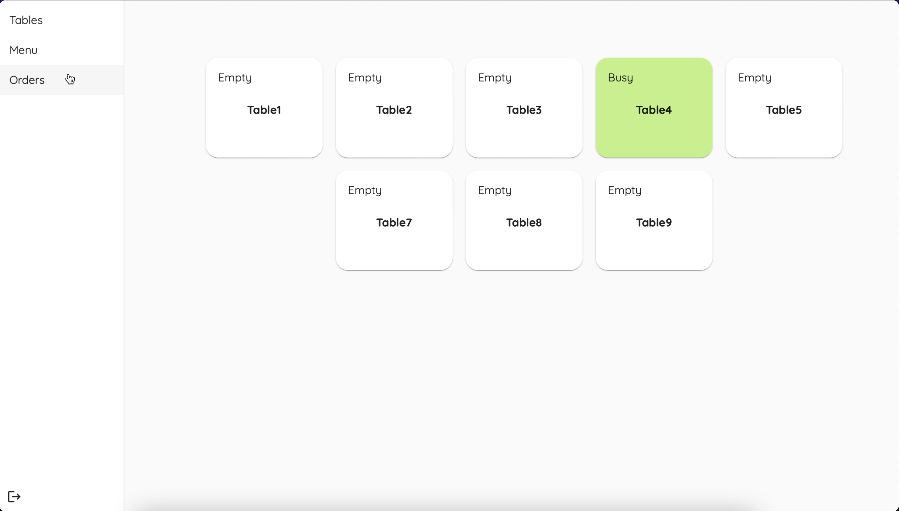
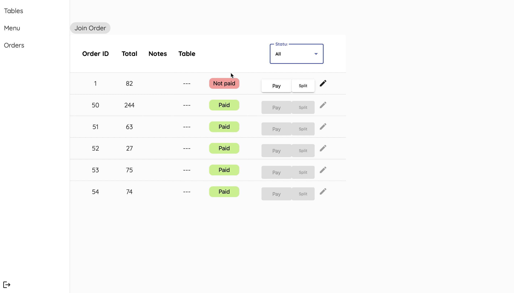
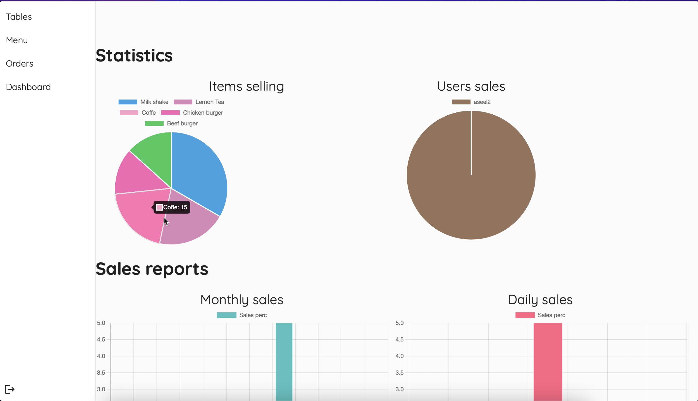

# 🍽️ Restaurant Management System

This project is a comprehensive Restaurant Management System developed using Angular, Spring Boot, and MySQL. The application aims to simplify the payment process, manage orders, and handle various restaurant operations efficiently.

## 🌟 Project Overview

The Restaurant Management System is designed to streamline restaurant operations by providing features for managing tables, orders, and payments. It includes functionalities for joining and splitting tables, managing order items, and providing a user-friendly interface for restaurant employees and administrators.

## 🚀 Technologies Used

- **Frontend:** Angular
- **Backend:** Spring Boot
- **Database:** MySQL

## 📋 Features

### Tables Management
- **Table Status:** Displays the status of each table (busy or available) with color coding (green for busy, white for available).
- **Join Tables:** Ability to join multiple tables, merging their orders into one.
- **Split Tables:** Ability to split one order into multiple orders across different tables.

### Menu Management
- **Categories:** Menu items are organized into multiple categories.
- **Order Management:** Add items to an order, increase or decrease item quantity, and delete items.
- **Search Functionality:** Search for items in the menu.

### Orders Management
- **View Orders:** Display orders with options to filter by paid and unpaid status.
- **Order Notes:** Add notes to orders.
- **Order Payment:** Handle payment for individual items or entire orders.

### Admin Panel
- **Order Overview:** View paid and unpaid orders of all users.
- **Statistics & Graphs:** Display sales data, best-selling items, user activity, purchased items, and table statuses.

### User Authentication
- **Login:** Secure login for restaurant employees and administrators.
- **Roles:** Access control based on user roles (employee or admin).

## 🖥️ Running the Application

### Prerequisites
- Node.js
- Angular CLI
- MySQL
- Java Development Kit (JDK)

### Frontend (Angular)
1. Navigate to the Angular project directory.
2. Install dependencies:
    ```bash
    npm install
    ```
3. Start the application:
    ```bash
    npm start
    ```

### Backend (Spring Boot)
1. Configure the MySQL database in the `application.properties` file.
2. Build and run the Spring Boot application:
    ```bash
    mvn spring-boot:run
    ```

## 📸 Screenshots


*Tables Page: Displays the status of tables in the restaurant.*


*Menu Page: Allows employees to manage and search for menu items.*


*Orders Page: Displays orders with options to filter by status.*


*Admin Panel: Provides an overview of orders, statistics, and more.*

## 🗺️ Database Schema


*Database schema diagram illustrating the structure of the system.*

## 📹 Demo Videos

- [User System Overview]([path/to/system-overview-video.mp4](https://drive.google.com/file/d/1zBRtUVEb2hhnG7-TSvqokGeCwbiVcQ5x/view?usp=sharing))
- [Admin Panel]([path/to/admin-panel-video.mp4](https://drive.google.com/file/d/1AIg9KyQb85Ghy5Ou6u34LntRB6JfIBoE/view?usp=sharing))


## 📄 License

This project is licensed under the MIT License - see the [LICENSE](LICENSE) file for details.

---

Developed with ❤️ by [Aseel Hamayel]
